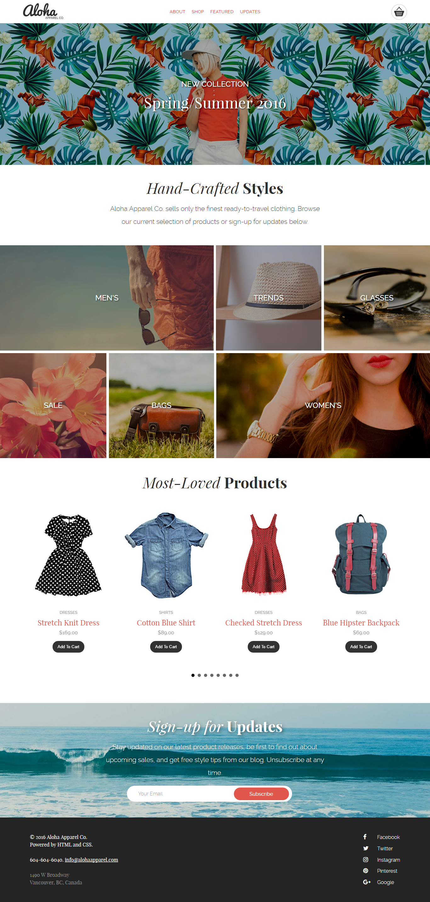

#Aloha Project 2

###Software:
	
- Atom Text (editing)
	
- Chrome (testing)
	
- GIT Bash (repo upload)

###Technologies Used
	
- html5, css3
, jquery(version 1.12.4 min - this version works with bxslider)
- keeping my codes clean, structured, and easy to read
	
- Used Font Squirrel to Download Font packages
	
- Used GIT Bash to push my local repo to Git Hub
	
- Validated index.html, style.css and reset.css

- Checked my main.js in Jslint
- Learned how to position elements by flexbox
- Executed Jsplugins/code
	- fixed navbar with a class change on scroll down
	- email validator

###Stretched/Extra Goals
	
- Fixed header with a background change

###Future Goals
	
- Efficiently practice positioning elements within its div or section
(flexbox)
- Be able to understand how other peoples javascript codes just by reading it
